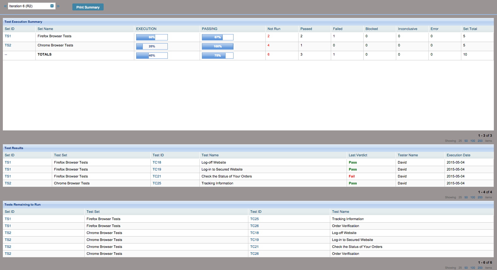

Test-Status-by-Test-Set
================================

This app conveys test status for a selected ITERATION in 3 sections:

- First, a full test summary, which includes each test set ID and name, percentage of tests executed, percentage of tests passing, number passed, number failed, number remaining, etc.
- Second, a list of the tests which have been run and whether they passed or failed in their last run.
- Third, a list of the tests which are remaining to be run.

Screenshot:

